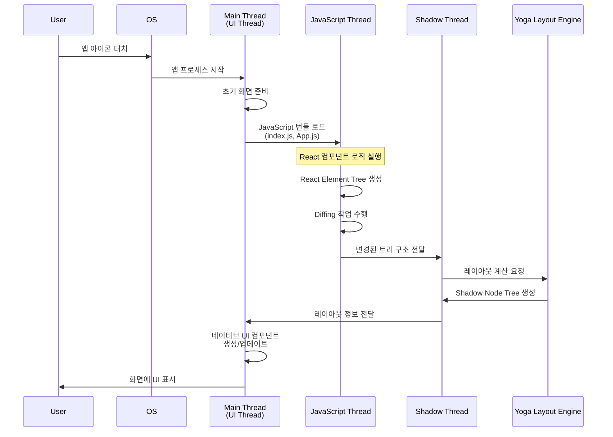

# React Native CLI 학습 정리

React Native CLI를 중심으로 모바일 앱 개발에 필요한 핵심 개념과 실무 팁을 정리한 초안입니다.

## 1) React Native CLI에 대해서

### 1-1. React Native CLI란?
- Facebook(현 Meta)이 만든 크로스플랫폼 프레임워크인 React Native를 순정(베어) 환경에서 사용하는 명령줄 도구입니다.
- iOS/Android의 네이티브 프로젝트 구조를 그대로 생성하고, Xcode/Android Studio와 긴밀하게 연동됩니다.
- Expo와 달리 네이티브 코드 수준의 커스터마이징(플러그인, 네이티브 모듈, 빌드 설정 변경 등)에 제약이 적습니다.
```shell
react-native log-android
react-native log-ios
- ```

### 1-2. React Native CLI 설정하기
```shell
brew install node
```
```shell
brew install watchman
````
```shell
brew install ruby
````
```shell
brew install ruby-build
````
```shell
brew install rbenv # 루비 버전 관리를 위함
````

- iOS 설정 확인:
  - Xcode 설치, Command Line Tools 설정
- AND 설정 확인:
```shell 
export ANDROID_HOME=$HOME/Library/Android/sdk
export PATH=$PATH:$ANDROID_HOME/emulator
export PATH=$PATH:$ANDROID_HOME/platform-tools
```
- 프로젝트 생성:
```shell
npx react-native init FirstProject
```
- ios pod 설치: 의존설 관리 도구
```shell
cd ios && pod install 
```
- 실행
```shell
npm run ios
```

### 1-3. Expo와의 차이점
- Expo: 빠른 시작, OTA 업데이트, 풍부한 SDK, 관리형/베어 워크플로우 제공. 단, 일부 네이티브 커스터마이징은 제한될 수 있음(관리형 기준).
- React Native CLI: 초기 설정은 더 수고롭지만, 네이티브 레벨 변경에 유연. 대규모/커스텀 네이티브 요구사항에 유리.
- 팀/프로젝트 요구사항에 따라 선택하거나, Expo Bare로 전환/혼합 전략도 가능.

### 1-4. 새로운 Dependency Manager 소개
- AND: gradle
  - build.gradle 
- iOS: cocoapods
  - Podfile

### 1-5. 디버그 도구 Flipper 소개
- Flipper
  - Layout Inspector
  - React DevTools
  - Images
  - Database
- React-Native-Debugger
- 등 여러가지 Debugging Tool이 있고 각자의 스타일에 따라 사용
---

## 2) AND/iOS에서 반드시 알아야 할 개념

### 2-1. Android
- AndroidManifest.xml: 앱의 권한, 액티비티, 서비스, 딥링크, 최소 SDK 등 메타데이터 선언 파일.
- Activity: 화면 단위의 컴포넌트. RN는 기본 Activity 위에 ReactRootView를 올려 RN UI를 렌더링합니다.
- Application: 앱 전역 초기화 지점, 네이티브 모듈 초기화, 디버그 설정 등을 배치.

### 2-2. iOS
- AppDelegate: 앱 생명주기 진입점, 푸시/딥링크 등 핸들링.
- Info.plist: 번들 메타데이터(권한 설명, URL Scheme, 설정 키 등)를 선언하는 파일.
- Build Phase: 빌드 시 실행되는 단계별 작업들로, 소스코드를 앱으로 변환하는 과정을 자동화하는 스크립트 모음

### 2-3. Permissions(권한)
- AND: Manifest에 권한 선언 + 런타임 권한 요청 필요 (위험 권한의 경우).
  사용자가 거부해도 앱은 반복해서 권한 요청 가능.
  단, "다시 묻지 않음"을 선택하면 시스템 다이얼로그는 나타나지 않고, 설정으로 유도해야 함.
- iOS: Info.plist에 권한 설명 키 (NSCameraUsageDescription 등) 필수.
  최초 1회 권한 요청만 시스템이 다이얼로그로 처리.
  사용자가 거부하면, 이후 재요청해도 시스템 다이얼로그는 다시 뜨지 않음.
- RN에서는 react-native-permissions 등의 라이브러리를 통해 두 플랫폼의 권한 요청 흐름을 통합할 수 있음

### 2-4. Scheme(스킴)
- URL Scheme/Universal Links(App Links)를 통해 외부에서 앱을 열거나 특정 화면으로 동.
- iOS: Info.plist URL Types 설정, Android: Manifest intent-filter 설정 필요.
- scheme 테스트:
```bash
npx uri-scheme open "scheme://path" --ios
npx uri-scheme open "scheme://path" --android
````
---

## 3) Native Module이 뭔가요?

### 3-1. React Native가 동작하는 원리(개요)
#### React Native 에서 다루는 Thread
- JavaScript 스레드와 네이티브(UI/메인) 스레드가 브리지 또는 JSI를 통해 상호작용합니다.
- JS에서 네이티브 기능(카메라, 센서 등)을 호출하고, 네이티브는 결과를 JS로 전달합니다.

```
- MainThread: 네이티브 UI를 그려주고, 사용자 입력을 처리하는 역할
- Javascript Thread: 작성한 JS 코드를 실행하고 로직을 처리하는 역할
- Native Module Thread: JS에서 호출된 네이티브 모듈을 처리하는 역할
- Shadow Thread: 레이아웃 계산 (Yoga 엔진 사용), 실제 레이아웃 정보가 계산되면 Main Thread에 전달되어 UI가 그려짐
```



### 3-2. Native Module이란?
- JS에서 접근할 수 있도록 네이티브 기능을 래핑한 모듈입니다.
- iOS(Objective-C/Swift), Android(Java/Kotlin)로 구현하며, JS/TS로 공개 API를 제공합니다.

### 3-3. New Architecture(새 아키텍처)
- Fabric(UI 레이어)와 TurboModules(네이티브 모듈) + JSI 기반으로 브리지 의존도를 낮추고 성능/타입 안전성 개선을 지향합니다.
- Codegen을 통해 네이티브-JS 인터페이스를 자동 생성하여 일관성 및 유지보수성을 높입니다.
<br><br>
- [AS-IS:
```text
[JS Thread]
   |
  (JSON으로 데이터 포장)
   |
[Bridge]  ← 느림 / 비동기 / 병목
   |
[Native Modules]
```
- TO-BE
```text
[JS Thread]  ⇄  [JSI (C++)] ⇄ [TurboModules / Fabric / Native Modules]
             (동기 / 빠름 / 직렬화 없음)
```
### 3-4. Hermes
- RN에 최적화된 경량 JS 엔진. 빠른 시작 시간, 낮은 메모리 사용이 장점.
- 대부분의 최신 RN 버전에서 기본 활성화되며, 성능 문제 해결에 큰 효과가 있습니다.

### 3-5. New Architecture 프로젝트 만들어보기(개요)
- 프로젝트 생성 시 최신 RN 버전을 사용하고, iOS/Android 설정에서 새 아키텍처 플래그를 켭니다.
- 의존성과 플러그인이 새 아키텍처를 지원하는지 확인 후 빌드/실행합니다.
```
# 예시(버전과 옵션은 프로젝트 상황에 맞게 조정)
npx @react-native-community/cli@latest init MyRnApp
cd MyRnApp
# iOS/Android 빌드 설정에서 새 아키텍처 옵션 활성화 후 빌드
```

### 3-6. Wrap up
- RN CLI는 네이티브까지 제어가 필요한 팀에 적합합니다.
- 플랫폼 기본 개념(Manifest/AppDelegate/권한/스킴)을 이해하면 문제 해결 속도가 크게 빨라집니다.
- 새 아키텍처와 Hermes를 활용하면 성능과 개발 경험을 개선할 수 있습니다.
---